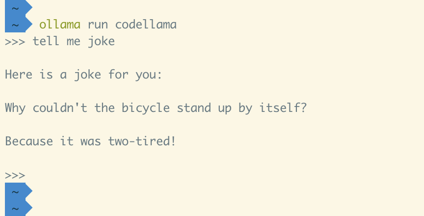
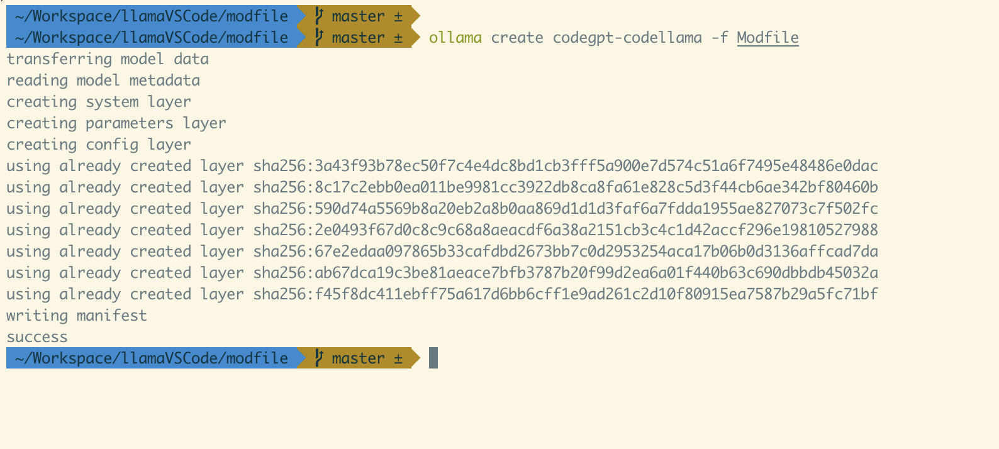
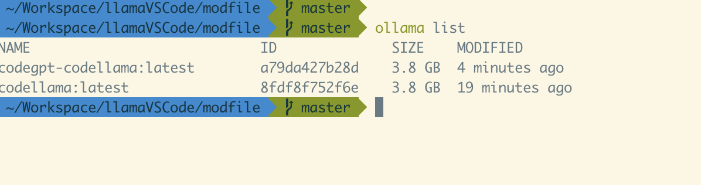
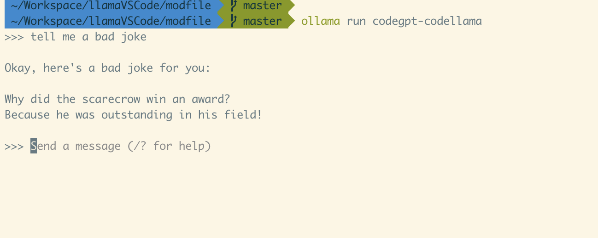
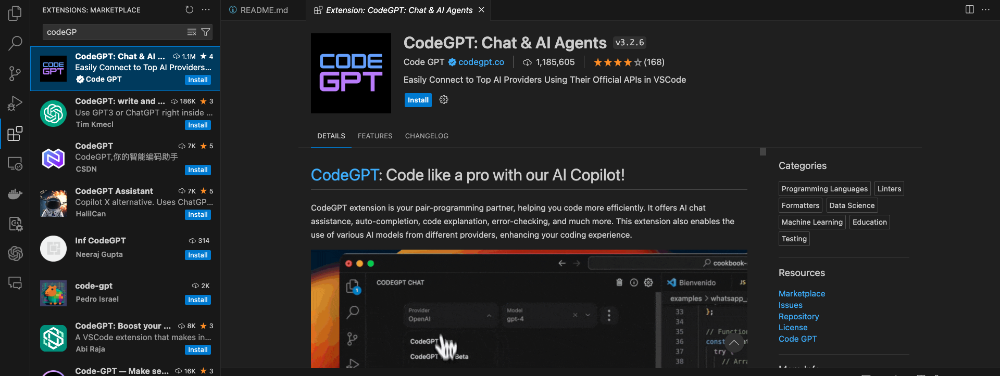
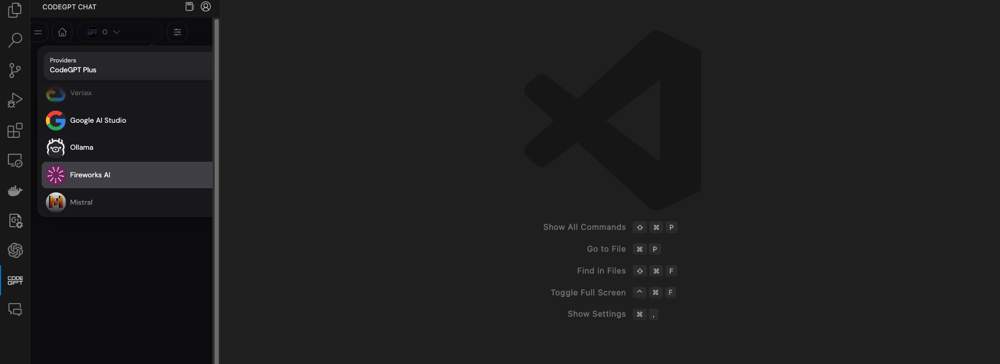
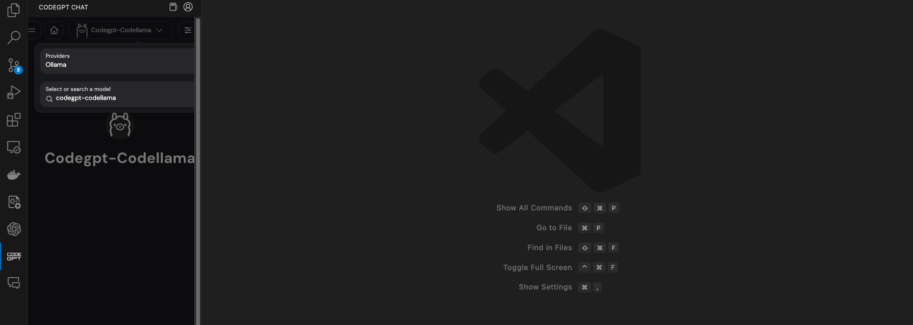
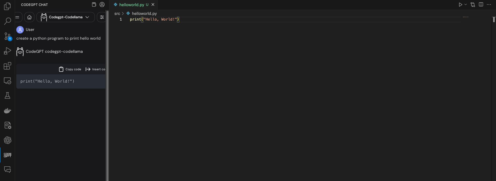

# llamaVSCode
Using Llama to with VSCode

## Download and Install LLAMA

Download and install [Ollama](https://ollama.com/download). 

## CodeLLAMA

There are multiple LLM available for Ollama. In this case we will be using __*Codellama*__ which can use text prompts to generate and discuss code. Once Ollama is installed download  __*Codellama*__ model
```
ollama pull codellama
```

Recheck if the model is available locally

```
ollama list
```

run __*Codellama*__

```
ollama run codellama
```

test the model 



## Model File

A [model file](https://github.com/ollama/ollama/blob/main/docs/modelfile.md) is the blueprint to create and share models with Ollama.

```
FROM codellama

# sets the temperature to 1 [higher is more creative, lower is more coherent]
PARAMETER temperature 1

# sets the context window size to 1500, this controls how many tokens the LLM can use as context to generate the next token
PARAMETER num_ctx 1500

# sets a custom system message to specify the behavior of the chat assistant
SYSTEM You are expert Code Assistant
```

activate the new configuration

```
ollama create codegpt-codellama -f Modfile 
```



Check id the new configuration is listed

```
ollama list
```



Test the new configuration

```
ollama run codegpt-codellama
```



## CodeGPT Extension

Install the codeGPT extension in [VSCode](https://code.visualstudio.com/download).



Then select __*Ollama*__ from the dropdown menu 



and select the configuration we created



## Generate Code



